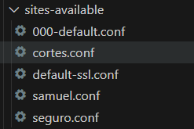

# Cómo configurar tu servidor Apache

 **Busca los archivos en el proyecto y utilízalos como referencia para tus propias configuraciones.**

## Estructura de archivos

1. **Carpeta sites-available:**  
   - Creamos una carpeta `sites-available`, donde copiamos el archivo `default.conf y creamos los archivos de configuración de nuestros dominios que usaremos en el futuro

   
