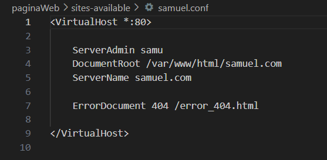
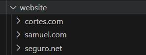
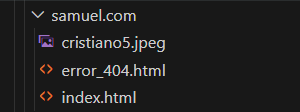
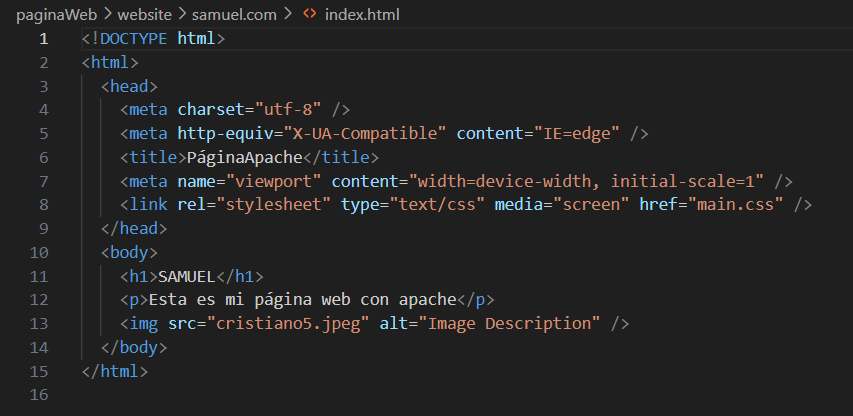
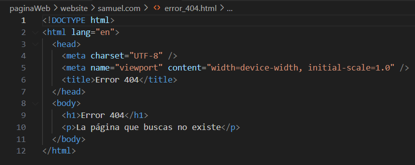
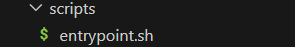
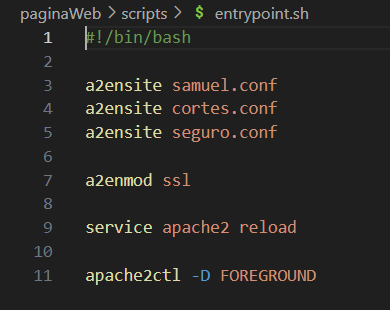

# Cómo configurar tu servidor Apache

## Estructura de archivos

1. **Carpeta sites-available**  
   - Creamos una carpeta sites-available, donde copiamos el archivo `default.conf y creamos los archivos de configuración de nuestros dominios que usaremos en el futuro

   

   - Esto en un ejemplo de configuración que voy a utilizar para mi primer dominio usando samuel.conf
   

2. **Carpeta website**
    - Creamos una carpeta website, que será el directorio que alojará los dominios para cada dominio
    

    - Dentro de cada respectivo dominio crearemos nuestros respectivos html básico (index) y con sus respectivos errores que a su vez son html
    -Ejemplo del dominio samuel.com con su index.html y su error_404.html
    
    
    

3. **Privado**
    -Para el dominio privado con SSL, crearemos una carpeta 'privado' donde alojaremos los anteriormente mencionados html y errores para dicho dominio
    

4. **Scripts**
    -Crearemos una carpeta scripts que a su vez tendrá dentro un fichero.sh (en mi caso entrypoint.sh) que se encargará de ejecutar los comandos para habilitar los sitios, activar el módulo SSL y reiniciar el servicio de Apache. 
    

    
    

